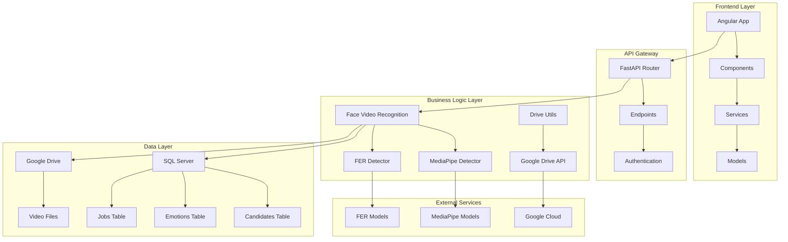
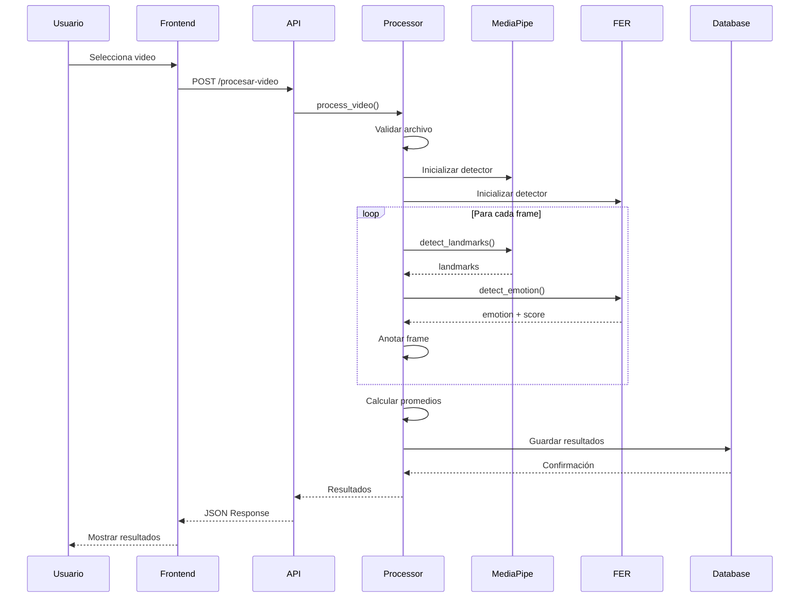
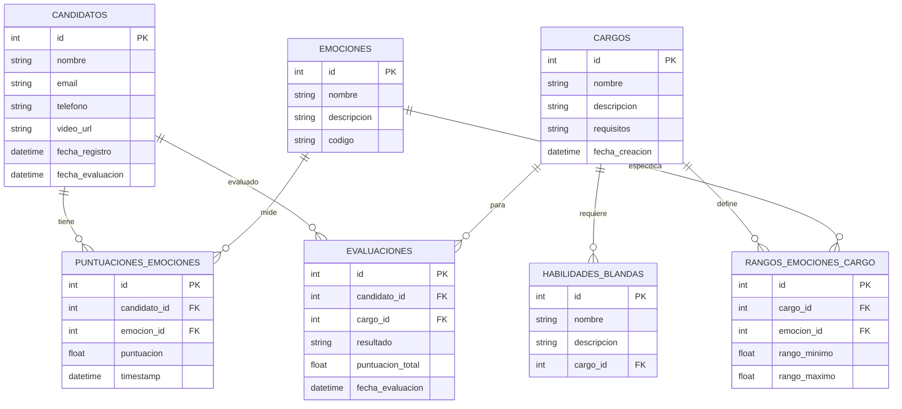
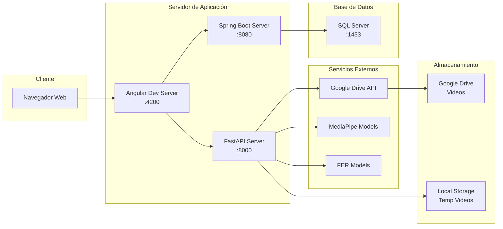
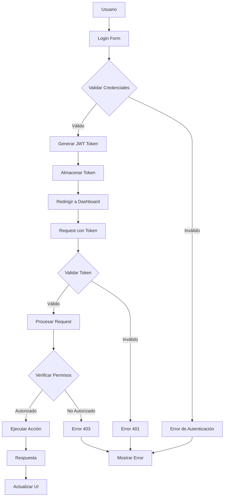
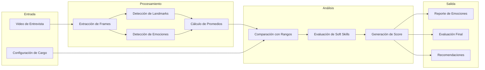
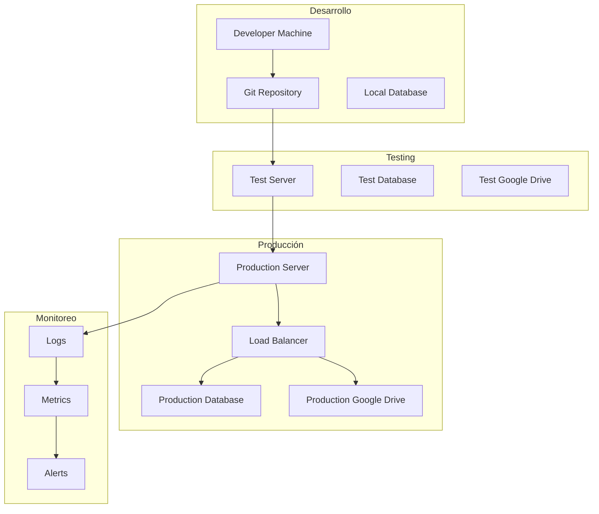
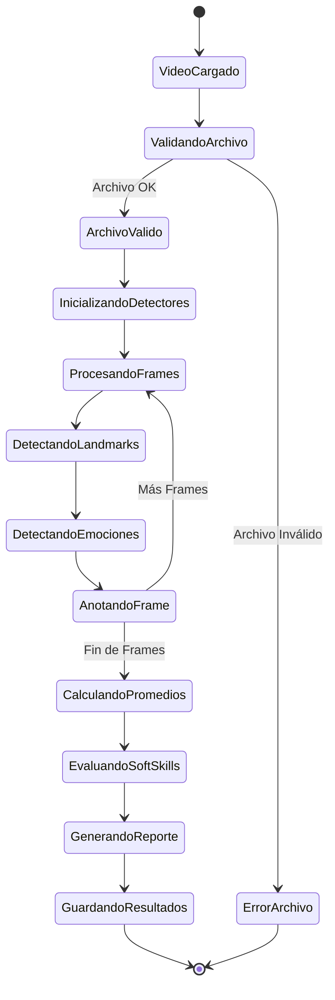
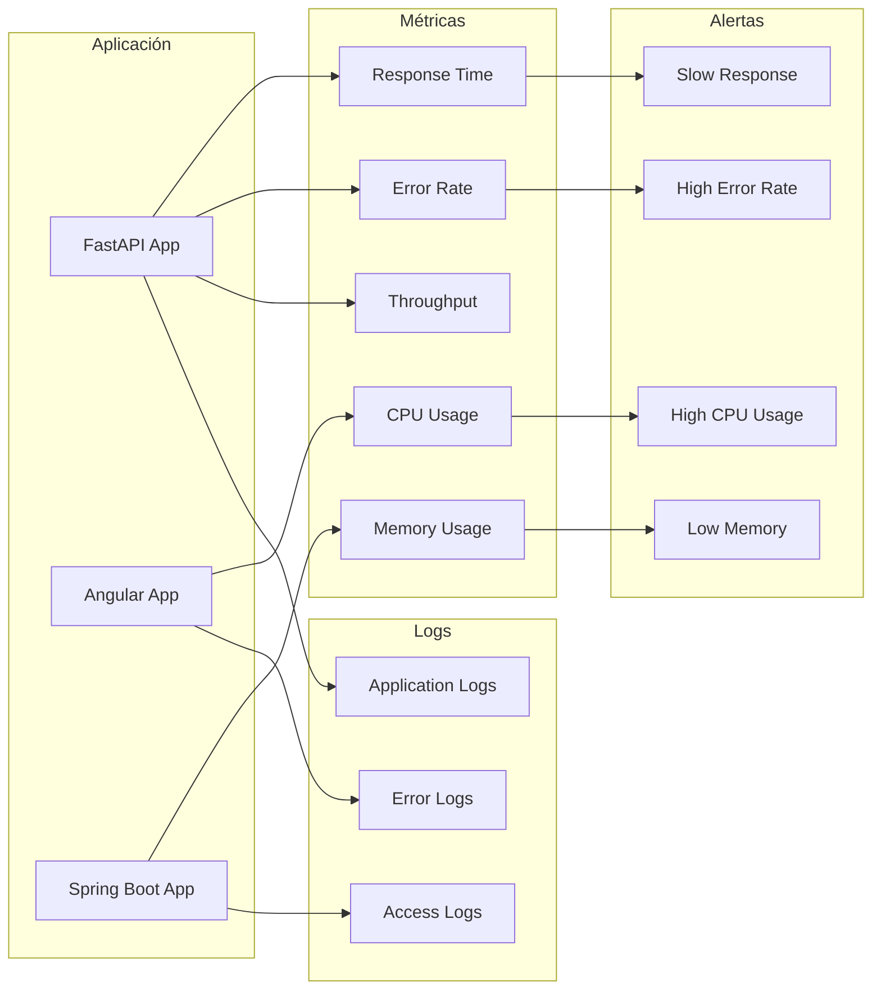
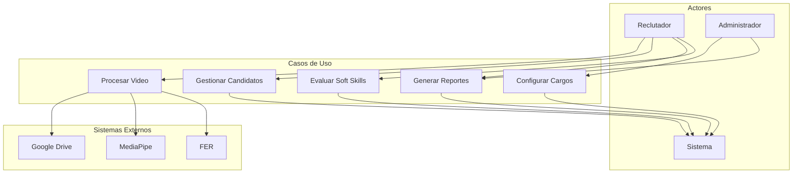

# 🔧 Diagramas Técnicos del Sistema SoftSkillsVision

## 📊 Diagrama de Arquitectura de Componentes

## 🔄 Diagrama de Secuencia - Procesamiento de Video

## 🗄️ Diagrama de Base de Datos

## 🌐 Diagrama de Red y Comunicación

## 🔐 Diagrama de Seguridad y Autenticación

## 📈 Diagrama de Flujo de Datos

## 🚀 Diagrama de Despliegue

## 🔄 Diagrama de Estados - Proceso de Evaluación

## 📊 Diagrama de Métricas y Monitoreo

## 🎯 Diagrama de Casos de Uso Detallado

---

## 📋 Resumen de Diagramas

1. **Arquitectura de Componentes**: Muestra la estructura general del sistema
2. **Secuencia**: Detalla el flujo de procesamiento de videos
3. **Base de Datos**: Estructura de datos y relaciones
4. **Red y Comunicación**: Conectividad entre servicios
5. **Seguridad**: Flujo de autenticación y autorización
6. **Flujo de Datos**: Transformación de datos en el sistema
7. **Despliegue**: Arquitectura de infraestructura
8. **Estados**: Estados del proceso de evaluación
9. **Métricas**: Monitoreo y observabilidad
10. **Casos de Uso**: Interacciones de usuarios con el sistema

Estos diagramas proporcionan una visión completa y técnica del sistema SoftSkillsVision, facilitando la comprensión, mantenimiento y evolución del mismo.
