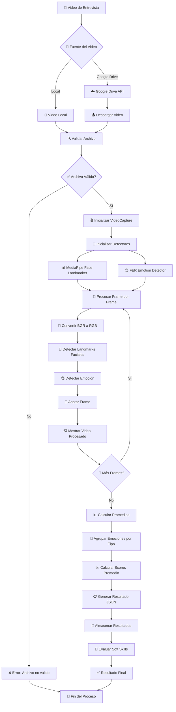
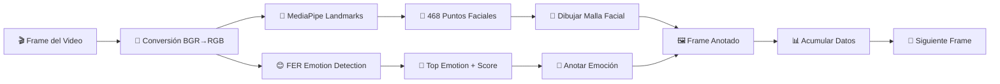
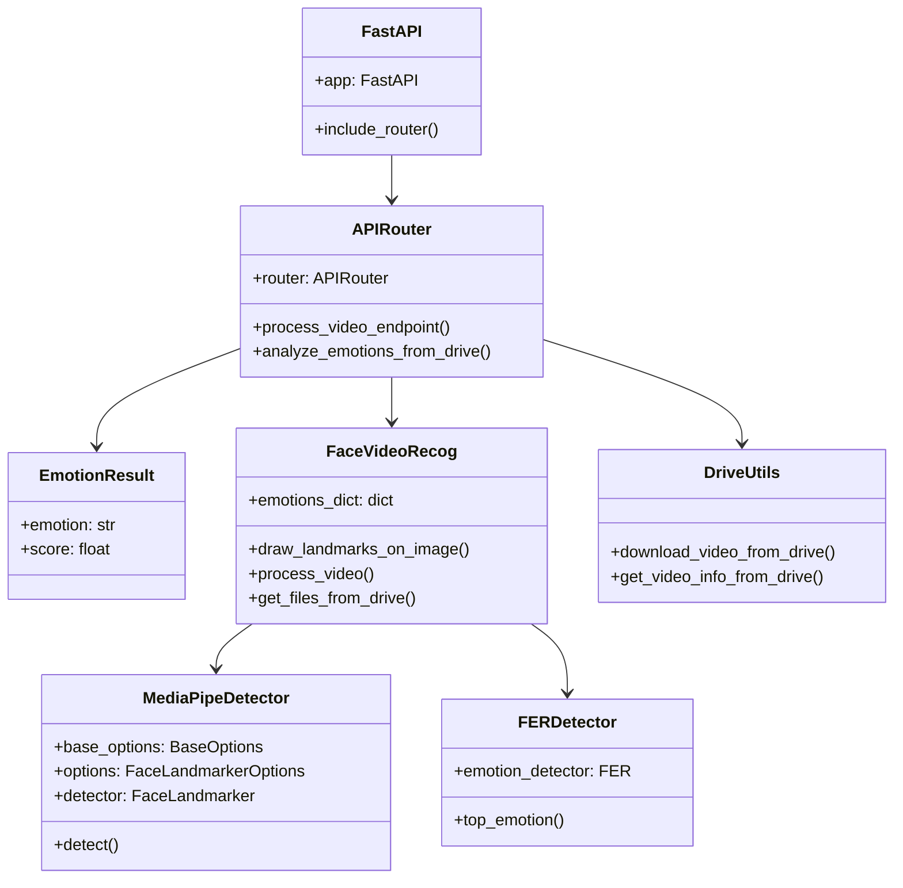
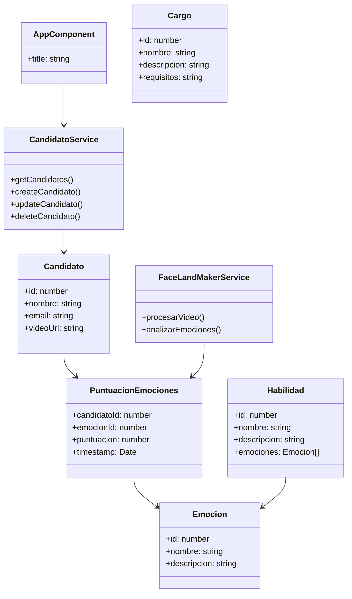

# 📊 Documentación Completa del Sistema SoftSkillsVision

## 🎯 Resumen Ejecutivo

**SoftSkillsVision** es un sistema ATS (Applicant Tracking System) que utiliza inteligencia artificial para evaluar las habilidades blandas (soft skills) de candidatos mediante el análisis de videos de entrevistas. El sistema detecta 7 emociones básicas y determina si un candidato posee las competencias emocionales requeridas para un puesto específico.

---

## 🏗️ Arquitectura del Sistema

### Componentes Principales

```
┌─────────────────────────────────────────────────────────────┐
│                    SoftSkillsVision                        │
│                  Sistema ATS con IA                        │
└─────────────────────────────────────────────────────────────┘
                              │
                    ┌─────────┼─────────┐
                    │         │         │
            ┌───────▼───┐ ┌───▼───┐ ┌───▼────────┐
            │           │ │       │ │            │
            │ SoftSkills│ │SoftSkills│ │SoftSkills  │
            │  Vision   │ │ Vision │ │ Vision     │
            │  (Python) │ │ Front  │ │ BackEnd    │
            │           │ │(Angular)│ │ (Spring)   │
            │   IA &    │ │        │ │            │
            │ Business  │ │   UI   │ │ Database   │
            │  Logic    │ │        │ │ Connection │
            └───────────┘ └────────┘ └────────────┘
```

### 1. **Backend Python (IA & Business Logic)**
- **Framework**: FastAPI
- **IA**: MediaPipe + FER (Facial Emotion Recognition)
- **Procesamiento**: OpenCV + TensorFlow
- **Almacenamiento**: Google Drive API

### 2. **Frontend Angular**
- **Framework**: Angular 19
- **UI**: Bootstrap 5 + ngx-bootstrap
- **Lenguaje**: TypeScript

### 3. **Backend Java**
- **Framework**: Spring Boot 3.4.4
- **Base de Datos**: SQL Server
- **ORM**: Spring Data JPA

---

## 🔄 Diagrama de Flujo del Proceso Principal



---

## 🎭 Proceso de Detección de Emociones

### Emociones Detectadas
1. **Neutro** - Estado neutral
2. **Feliz** - Alegría y satisfacción
3. **Triste** - Melancolía y pena
4. **Enfadado** - Ira y frustración
5. **Miedo** - Ansiedad y preocupación
6. **Desagrado** - Repulsión y disgusto
7. **Sorpresa** - Asombro e incredulidad

### Algoritmo de Procesamiento



---

## 🏛️ Diagrama de Clases

### Backend Python



### Frontend Angular



---

## 🎯 Casos de Uso

### CU-001: Procesar Video de Entrevista

**Actor Principal**: Reclutador
**Precondiciones**: 
- El sistema está funcionando
- El video está disponible (local o en Google Drive)

**Flujo Principal**:
1. El reclutador selecciona un video de entrevista
2. El sistema valida el archivo de video
3. El sistema procesa el video frame por frame
4. Para cada frame:
   - Detecta landmarks faciales con MediaPipe
   - Detecta emociones con FER
   - Anota el frame con la información
5. El sistema calcula promedios de emociones
6. El sistema genera un reporte de emociones
7. El sistema evalúa las soft skills del candidato
8. El sistema presenta los resultados al reclutador

**Flujos Alternativos**:
- **3a**: Si el video no es válido, mostrar error
- **4a**: Si no se detecta cara, continuar con el siguiente frame
- **5a**: Si no hay suficientes datos, solicitar video más largo

**Postcondiciones**:
- Se genera un reporte de emociones
- Se evalúan las soft skills del candidato
- Los resultados se almacenan en la base de datos

### CU-002: Analizar Videos desde Google Drive

**Actor Principal**: Reclutador
**Precondiciones**:
- Credenciales de Google Drive configuradas
- Acceso a la carpeta de videos

**Flujo Principal**:
1. El reclutador especifica el ID de la carpeta de Google Drive
2. El sistema se conecta a Google Drive API
3. El sistema lista todos los videos en la carpeta
4. Para cada video:
   - Descarga el video temporalmente
   - Procesa el video (CU-001)
   - Elimina el archivo temporal
5. El sistema genera un reporte consolidado
6. El sistema presenta los resultados al reclutador

### CU-003: Gestionar Candidatos

**Actor Principal**: Reclutador
**Precondiciones**: Usuario autenticado

**Flujo Principal**:
1. El reclutador accede a la lista de candidatos
2. El sistema muestra la lista de candidatos
3. El reclutador puede:
   - Ver detalles de un candidato
   - Editar información del candidato
   - Ver resultados de evaluación
   - Eliminar candidato
4. El sistema actualiza la información según la acción

### CU-004: Configurar Rangos de Emociones por Cargo

**Actor Principal**: Administrador
**Precondiciones**: Usuario con permisos de administrador

**Flujo Principal**:
1. El administrador selecciona un cargo
2. El sistema muestra los rangos actuales de emociones
3. El administrador modifica los rangos según los requisitos del cargo
4. El sistema valida los rangos
5. El sistema guarda la configuración
6. El sistema confirma la actualización

---

## 👥 Historias de Usuario

### Epic 1: Procesamiento de Videos

#### HU-001: Como reclutador, quiero procesar un video de entrevista para evaluar las emociones del candidato
**Criterios de Aceptación**:
- ✅ Puedo cargar un video desde mi computadora
- ✅ Puedo especificar un video desde Google Drive
- ✅ El sistema detecta 7 emociones básicas
- ✅ Recibo un reporte con puntuaciones de emociones
- ✅ El procesamiento toma menos de 5 minutos para un video de 10 minutos

**Definición de Terminado**:
- [ ] Video se procesa correctamente
- [ ] Emociones se detectan con precisión >80%
- [ ] Reporte se genera en formato JSON
- [ ] Interfaz muestra progreso del procesamiento

#### HU-002: Como reclutador, quiero procesar múltiples videos de una carpeta de Google Drive
**Criterios de Aceptación**:
- ✅ Puedo especificar el ID de una carpeta de Google Drive
- ✅ El sistema procesa todos los videos de la carpeta
- ✅ Recibo un reporte consolidado por video
- ✅ Los videos se procesan en paralelo cuando es posible

### Epic 2: Gestión de Candidatos

#### HU-003: Como reclutador, quiero registrar un nuevo candidato
**Criterios de Aceptación**:
- ✅ Puedo ingresar nombre, email y información básica
- ✅ Puedo asociar un video de entrevista
- ✅ El sistema valida que el email sea único
- ✅ Recibo confirmación del registro

#### HU-004: Como reclutador, quiero ver la lista de candidatos con sus evaluaciones
**Criterios de Aceptación**:
- ✅ Veo una tabla con todos los candidatos
- ✅ Puedo filtrar por nombre, email o cargo
- ✅ Veo las puntuaciones de emociones de cada candidato
- ✅ Puedo ordenar por diferentes criterios

### Epic 3: Evaluación de Soft Skills

#### HU-005: Como reclutador, quiero evaluar si un candidato tiene las soft skills requeridas para un cargo
**Criterios de Aceptación**:
- ✅ Puedo seleccionar un candidato y un cargo
- ✅ El sistema compara las emociones del candidato con los requisitos del cargo
- ✅ Recibo una evaluación clara (Apto/No Apto)
- ✅ Veo un desglose de por qué el candidato es apto o no

#### HU-006: Como administrador, quiero configurar los rangos de emociones ideales para cada cargo
**Criterios de Aceptación**:
- ✅ Puedo seleccionar un cargo
- ✅ Puedo establecer rangos mínimos y máximos para cada emoción
- ✅ El sistema valida que los rangos sean lógicos
- ✅ Los cambios se aplican inmediatamente

### Epic 4: Reportes y Análisis

#### HU-007: Como reclutador, quiero generar reportes de evaluación de candidatos
**Criterios de Aceptación**:
- ✅ Puedo filtrar candidatos por diferentes criterios
- ✅ Puedo exportar reportes en PDF o Excel
- ✅ Los reportes incluyen gráficos de emociones
- ✅ Puedo comparar múltiples candidatos

#### HU-008: Como administrador, quiero ver estadísticas generales del sistema
**Criterios de Aceptación**:
- ✅ Veo número total de candidatos evaluados
- ✅ Veo distribución de emociones por cargo
- ✅ Veo tendencias temporales
- ✅ Puedo exportar estadísticas

---

## 🔧 Tecnologías y Dependencias

### Backend Python
```python
# Framework API
fastapi==0.104.1
uvicorn[standard]==0.24.0

# Procesamiento de imágenes y video
opencv-python==4.8.1.78
opencv-contrib-python==4.8.1.78
numpy==1.24.3
mediapipe==0.10.7

# Machine Learning / Deep Learning
tensorflow==2.13.0
fer==22.5.1  # Reconocimiento de emociones

# Manipulación multimedia
ffmpeg-python==0.2.0
moviepy==1.0.3

# Google API
google-api-python-client==2.108.0
google-auth==2.23.4
google-auth-oauthlib==1.1.0
gdown==4.7.1

# Validaciones y modelos
pydantic==2.5.0
```

### Frontend Angular
```json
{
  "dependencies": {
    "@angular/animations": "^19.0.0",
    "@angular/common": "^19.0.0",
    "@angular/compiler": "^19.0.0",
    "@angular/core": "^19.0.0",
    "@angular/forms": "^19.0.0",
    "@angular/platform-browser": "^19.0.0",
    "@angular/platform-browser-dynamic": "^19.0.0",
    "@angular/router": "^19.0.0",
    "bootstrap": "^5.3.2",
    "ngx-bootstrap": "^12.0.0",
    "rxjs": "~7.8.0",
    "tslib": "^2.3.0",
    "zone.js": "~0.14.0"
  }
}
```

### Backend Java
```xml
<dependencies>
    <dependency>
        <groupId>org.springframework.boot</groupId>
        <artifactId>spring-boot-starter-web</artifactId>
        <version>3.4.4</version>
    </dependency>
    <dependency>
        <groupId>org.springframework.boot</groupId>
        <artifactId>spring-boot-starter-data-jpa</artifactId>
        <version>3.4.4</version>
    </dependency>
    <dependency>
        <groupId>com.microsoft.sqlserver</groupId>
        <artifactId>mssql-jdbc</artifactId>
        <version>12.4.2.jre11</version>
    </dependency>
</dependencies>
```

---

## 📊 Métricas y KPIs

### Métricas Técnicas
- **Precisión de detección de emociones**: >80%
- **Tiempo de procesamiento**: <5 min para video de 10 min
- **Disponibilidad del sistema**: >99%
- **Tiempo de respuesta API**: <2 segundos

### Métricas de Negocio
- **Candidatos evaluados por día**: 50+
- **Tiempo promedio de evaluación**: 3 minutos
- **Tasa de precisión en selección**: >85%
- **Satisfacción del usuario**: >4.5/5

---

## 🚀 Instrucciones de Despliegue

### 1. Backend Python
```bash
cd SoftSkillsVision
python -m venv venv
venv\Scripts\activate  # Windows
pip install -r requirements.txt
uvicorn app.main:app --reload --host 0.0.0.0 --port 8000
```

### 2. Frontend Angular
```bash
cd SoftSkillsVisionFront
npm install
ng serve
```

### 3. Backend Java
```bash
cd SoftSkillsVisionBackEnd
mvn clean compile
mvn spring-boot:run
```

---

## 🔐 Consideraciones de Seguridad

1. **Autenticación**: Implementar JWT para APIs
2. **Autorización**: Control de acceso basado en roles
3. **Datos sensibles**: Encriptar videos y resultados
4. **API Keys**: Rotar credenciales periódicamente
5. **Logs**: Auditoría de accesos y operaciones

---

## 📈 Roadmap Futuro

### Fase 1 (Actual)
- ✅ Procesamiento básico de videos
- ✅ Detección de 7 emociones
- ✅ Integración con Google Drive
- ✅ Interfaz web básica

### Fase 2 (Próximos 3 meses)
- 🔄 Análisis de voz y tono
- 🔄 Detección de micro-expresiones
- 🔄 Machine Learning personalizado
- 🔄 Reportes avanzados

### Fase 3 (6 meses)
- 🔄 Integración con LinkedIn
- 🔄 Análisis predictivo
- 🔄 API pública
- 🔄 Mobile app

---

## 📞 Soporte y Contacto

- **Documentación**: [GitHub Wiki](https://github.com/usuario/SoftSkillsVision/wiki)
- **Issues**: [GitHub Issues](https://github.com/usuario/SoftSkillsVision/issues)
- **Email**: soporte@softskillsvision.com
- **Versión**: 0.0.1-SNAPSHOT

---

*Esta documentación se actualiza regularmente. Última actualización: Septiembre 2025*
