# 😊 Flujo Detallado de Procesamiento de Emociones

## 🎯 Proceso de Detección de Emociones

### 1. **Inicialización del Sistema**

```mermaid
flowchart TD
    A[🎬 Video de Entrevista] --> B[📁 Validar Archivo]
    B --> C{✅ Archivo Válido?}
    C -->|No| D[❌ Error: Archivo no válido]
    C -->|Sí| E[🎥 Inicializar VideoCapture]
    
    E --> F[🤖 Cargar Modelos IA]
    F --> G[📊 MediaPipe Face Landmarker]
    F --> H[😊 FER Emotion Detector]
    
    G --> I[⚙️ Configurar Detector]
    H --> J[⚙️ Configurar Detector]
    
    I --> K[🔄 Iniciar Procesamiento]
    J --> K
```



### 2. **Procesamiento Frame por Frame**

```mermaid
flowchart LR
    A[🎬 Frame Original] --> B[🎨 Conversión BGR→RGB]
    B --> C[👤 Detección de Cara]
    C --> D{👤 Cara Detectada?}
    
    D -->|No| E[⏭️ Siguiente Frame]
    D -->|Sí| F[📐 Extraer Landmarks]
    
    F --> G[🎯 468 Puntos Faciales]
    G --> H[😊 Detectar Emoción]
    
    H --> I[📊 Obtener Top Emotion]
    I --> J[📝 Anotar Frame]
    J --> K[🖼️ Mostrar Video]
    K --> L[💾 Almacenar Datos]
    L --> E
```



### 3. **Algoritmo de Detección de Emociones**

```mermaid
flowchart TD
    A[🎬 Frame RGB] --> B[🔍 Preprocesamiento]
    B --> C[📏 Redimensionar Imagen]
    C --> D[🎨 Normalizar Colores]
    D --> E[👤 Detectar Rostro]
    
    E --> F{👤 Rostro Encontrado?}
    F -->|No| G[❌ Sin Emoción]
    F -->|Sí| H[📐 Extraer Región Facial]
    
    H --> I[🤖 Modelo FER]
    I --> J[📊 7 Emociones Básicas]
    
    J --> K[🎯 Seleccionar Top Emotion]
    K --> L[📈 Calcular Confidence Score]
    L --> M[📝 Resultado: Emoción + Score]
```



### 4. **Las 7 Emociones Básicas**

```mermaid
graph LR
    A[😐 Neutro] --> B[Estado Neutral<br/>Score: 0.0-1.0]
    C[😊 Feliz] --> D[Alegría y Satisfacción<br/>Score: 0.0-1.0]
    E[😢 Triste] --> F[Melancolía y Pena<br/>Score: 0.0-1.0]
    G[😠 Enfadado] --> H[Ira y Frustración<br/>Score: 0.0-1.0]
    I[😨 Miedo] --> J[Ansiedad y Preocupación<br/>Score: 0.0-1.0]
    K[🤢 Desagrado] --> L[Repulsión y Disgusto<br/>Score: 0.0-1.0]
    M[😲 Sorpresa] --> N[Asombro e Incredulidad<br/>Score: 0.0-1.0]
```



### 5. **Cálculo de Promedios**

```mermaid
flowchart TD
    A[📊 Datos de Emociones] --> B[🔄 Agrupar por Tipo]
    B --> C[😐 Neutro: Suma Scores]
    B --> D[😊 Feliz: Suma Scores]
    B --> E[😢 Triste: Suma Scores]
    B --> F[😠 Enfadado: Suma Scores]
    B --> G[😨 Miedo: Suma Scores]
    B --> H[🤢 Desagrado: Suma Scores]
    B --> I[😲 Sorpresa: Suma Scores]
    
    C --> J[📈 Dividir por Total Frames]
    D --> J
    E --> J
    F --> J
    G --> J
    H --> J
    I --> J
    
    J --> K[📋 Promedios Finales]
    K --> L[🎯 Evaluación Soft Skills]
```



### 6. **Evaluación de Soft Skills**

```mermaid
flowchart TD
    A[📊 Promedios de Emociones] --> B[🎯 Cargo Específico]
    B --> C[📋 Rangos Ideales]
    C --> D[🔍 Comparar Emociones]
    
    D --> E[😊 Feliz: 0.3-0.7]
    D --> F[😐 Neutro: 0.2-0.5]
    D --> G[😠 Enfadado: 0.0-0.2]
    D --> H[😢 Triste: 0.0-0.3]
    D --> I[😨 Miedo: 0.0-0.2]
    D --> J[🤢 Desagrado: 0.0-0.1]
    D --> K[😲 Sorpresa: 0.1-0.4]
    
    E --> L[✅ Dentro del Rango]
    F --> L
    G --> L
    H --> L
    I --> L
    J --> L
    K --> L
    
    L --> M{🎯 Todas las Emociones OK?}
    M -->|Sí| N[✅ APTO para el Cargo]
    M -->|No| O[❌ NO APTO para el Cargo]
    
    N --> P[📊 Generar Reporte]
    O --> P
```



## 🧮 Algoritmo de Cálculo de Scores

### Fórmula de Promedio por Emoción

```
Score_Promedio_Emoción = Σ(Score_Frame_i) / Total_Frames

Donde:
- Score_Frame_i = Puntuación de la emoción en el frame i
- Total_Frames = Número total de frames procesados
```

### Ejemplo de Cálculo

```
Frame 1: Feliz = 0.8, Neutro = 0.2
Frame 2: Feliz = 0.6, Neutro = 0.4
Frame 3: Feliz = 0.7, Neutro = 0.3

Promedio Feliz = (0.8 + 0.6 + 0.7) / 3 = 0.7
Promedio Neutro = (0.2 + 0.4 + 0.3) / 3 = 0.3
```

## 📊 Estructura de Datos de Resultado

```json
{
  "candidato_id": "123",
  "video_procesado": "entrevista_001.mp4",
  "fecha_procesamiento": "2025-09-03T18:46:06Z",
  "total_frames": 1500,
  "emociones": [
    {
      "emotion": "Neutro",
      "score": 0.45,
      "rango_ideal": [0.2, 0.5],
      "dentro_rango": true
    },
    {
      "emotion": "Feliz",
      "score": 0.62,
      "rango_ideal": [0.3, 0.7],
      "dentro_rango": true
    },
    {
      "emotion": "Triste",
      "score": 0.15,
      "rango_ideal": [0.0, 0.3],
      "dentro_rango": true
    },
    {
      "emotion": "Enfadado",
      "score": 0.08,
      "rango_ideal": [0.0, 0.2],
      "dentro_rango": true
    },
    {
      "emotion": "Miedo",
      "score": 0.12,
      "rango_ideal": [0.0, 0.2],
      "dentro_rango": true
    },
    {
      "emotion": "Desagrado",
      "score": 0.05,
      "rango_ideal": [0.0, 0.1],
      "dentro_rango": true
    },
    {
      "emotion": "Sorpresa",
      "score": 0.25,
      "rango_ideal": [0.1, 0.4],
      "dentro_rango": true
    }
  ],
  "evaluacion_final": {
    "resultado": "APTO",
    "puntuacion_total": 0.85,
    "emociones_fuera_rango": 0,
    "recomendaciones": "Candidato muestra un perfil emocional equilibrado ideal para el cargo."
  }
}
```

## 🎯 Rangos Ideales por Tipo de Cargo

### Cargo: Vendedor
```json
{
  "feliz": [0.4, 0.8],
  "neutro": [0.1, 0.4],
  "triste": [0.0, 0.2],
  "enfadado": [0.0, 0.1],
  "miedo": [0.0, 0.2],
  "desagrado": [0.0, 0.1],
  "sorpresa": [0.2, 0.5]
}
```

### Cargo: Analista
```json
{
  "feliz": [0.2, 0.5],
  "neutro": [0.3, 0.6],
  "triste": [0.0, 0.3],
  "enfadado": [0.0, 0.2],
  "miedo": [0.0, 0.3],
  "desagrado": [0.0, 0.2],
  "sorpresa": [0.1, 0.4]
}
```

### Cargo: Líder de Equipo
```json
{
  "feliz": [0.3, 0.6],
  "neutro": [0.2, 0.5],
  "triste": [0.0, 0.2],
  "enfadado": [0.0, 0.2],
  "miedo": [0.0, 0.2],
  "desagrado": [0.0, 0.1],
  "sorpresa": [0.1, 0.3]
}
```

## 🔍 Validaciones y Control de Calidad

### 1. **Validación de Detección**
- Mínimo 80% de frames con cara detectada
- Mínimo 60% de frames con emoción detectada
- Máximo 5% de frames con errores de procesamiento

### 2. **Control de Calidad**
- Verificar que los scores estén entre 0.0 y 1.0
- Validar que la suma de emociones no exceda 1.0
- Confirmar que al menos una emoción tenga score > 0.1

### 3. **Manejo de Errores**
- Frames sin cara: Continuar procesamiento
- Errores de detección: Usar emoción del frame anterior
- Fallos críticos: Detener procesamiento y reportar error

## 📈 Métricas de Rendimiento

### Tiempo de Procesamiento
- **Video 5 minutos**: ~2-3 minutos de procesamiento
- **Video 10 minutos**: ~4-5 minutos de procesamiento
- **Video 15 minutos**: ~6-8 minutos de procesamiento

### Precisión de Detección
- **Detección de cara**: >95%
- **Detección de emociones**: >80%
- **Precisión de clasificación**: >85%

### Recursos del Sistema
- **CPU**: 2-4 cores durante procesamiento
- **RAM**: 4-8 GB durante procesamiento
- **GPU**: Opcional, mejora rendimiento 2-3x

---

Este flujo detallado muestra cómo el sistema procesa las emociones desde la captura del video hasta la evaluación final de soft skills, proporcionando una base sólida para la toma de decisiones en el proceso de selección de personal.
