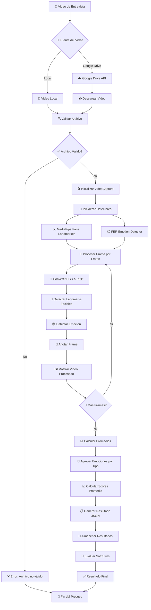
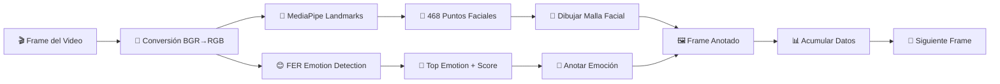
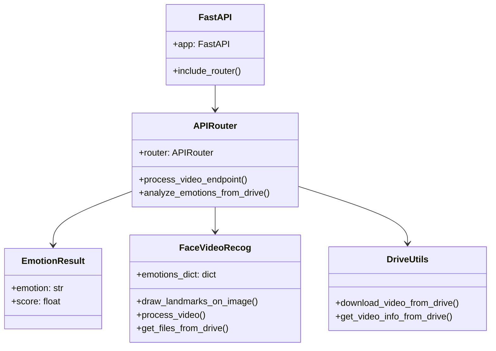
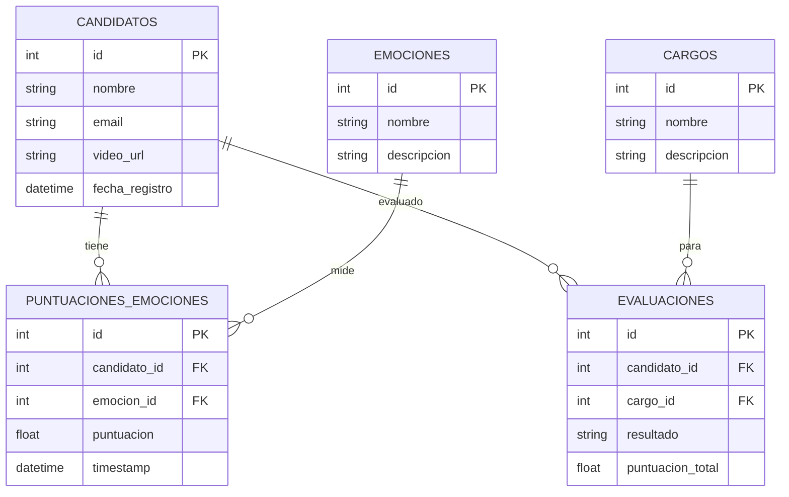

# 📋 Resumen Ejecutivo - SoftSkillsVision

## 🎯 Visión General del Sistema

**SoftSkillsVision** es un sistema innovador de evaluación de candidatos que utiliza inteligencia artificial para analizar videos de entrevistas y determinar las habilidades blandas (soft skills) de los candidatos mediante el reconocimiento de emociones faciales.

---

## 🏗️ Arquitectura del Sistema

```
┌─────────────────────────────────────────────────────────────┐
│                    SoftSkillsVision                        │
│                  Sistema ATS con IA                        │
└─────────────────────────────────────────────────────────────┘
                              │
                    ┌─────────┼─────────┐
                    │         │         │
            ┌───────▼───┐ ┌───▼───┐ ┌───▼────────┐
            │           │ │       │ │            │
            │ SoftSkills│ │SoftSkills│ │SoftSkills  │
            │  Vision   │ │ Vision │ │ Vision     │
            │  (Python) │ │ Front  │ │ BackEnd    │
            │           │ │(Angular)│ │ (Spring)   │
            │   IA &    │ │        │ │            │
            │ Business  │ │   UI   │ │ Database   │
            │  Logic    │ │        │ │ Connection │
            └───────────┘ └────────┘ └────────────┘
```

### Componentes:
- **Backend Python**: Procesamiento de IA y lógica de negocio
- **Frontend Angular**: Interfaz de usuario web
- **Backend Java**: Gestión de base de datos y APIs

---

## 🔄 Flujo Principal del Sistema



---

## 😊 Proceso de Detección de Emociones

### Las 7 Emociones Básicas Detectadas:

1. **😐 Neutro** - Estado neutral
2. **😊 Feliz** - Alegría y satisfacción  
3. **😢 Triste** - Melancolía y pena
4. **😠 Enfadado** - Ira y frustración
5. **😨 Miedo** - Ansiedad y preocupación
6. **🤢 Desagrado** - Repulsión y disgusto
7. **😲 Sorpresa** - Asombro e incredulidad

### Algoritmo de Procesamiento:



---

## 🎯 Casos de Uso Principales

### CU-001: Procesar Video de Entrevista
**Actor**: Reclutador
**Descripción**: El sistema procesa un video de entrevista y genera un reporte de emociones del candidato.

### CU-002: Analizar Videos desde Google Drive  
**Actor**: Reclutador
**Descripción**: El sistema procesa múltiples videos desde una carpeta de Google Drive.

### CU-003: Gestionar Candidatos
**Actor**: Reclutador
**Descripción**: CRUD completo de candidatos con sus evaluaciones.

### CU-004: Configurar Rangos de Emociones
**Actor**: Administrador
**Descripción**: Configurar los rangos ideales de emociones para cada tipo de cargo.

---

## 👥 Historias de Usuario Clave

### Epic 1: Procesamiento de Videos
- **HU-001**: Procesar video de entrevista para evaluar emociones
- **HU-002**: Procesar múltiples videos desde Google Drive

### Epic 2: Gestión de Candidatos  
- **HU-003**: Registrar nuevo candidato
- **HU-004**: Ver lista de candidatos con evaluaciones

### Epic 3: Evaluación de Soft Skills
- **HU-005**: Evaluar soft skills del candidato para un cargo
- **HU-006**: Configurar rangos de emociones por cargo

### Epic 4: Reportes y Análisis
- **HU-007**: Generar reportes de evaluación
- **HU-008**: Ver estadísticas generales del sistema

---

## 🏛️ Arquitectura de Clases

### Backend Python


---

## 🗄️ Modelo de Base de Datos



---

## 🚀 Tecnologías Utilizadas

### Backend Python (IA & Business Logic)
- **FastAPI** - Framework web moderno
- **MediaPipe** - Detección de landmarks faciales
- **FER** - Reconocimiento de emociones
- **OpenCV** - Procesamiento de video
- **TensorFlow** - Machine Learning
- **Google Drive API** - Integración con Google Drive

### Frontend Angular
- **Angular 19** - Framework frontend
- **Bootstrap 5** - Framework CSS
- **TypeScript** - Lenguaje de programación
- **RxJS** - Programación reactiva

### Backend Java
- **Spring Boot 3.4.4** - Framework Java
- **Spring Data JPA** - Persistencia de datos
- **SQL Server** - Base de datos
- **Java 21** - Lenguaje de programación

---

## 📊 Métricas y KPIs

### Métricas Técnicas
- **Precisión de detección de emociones**: >80%
- **Tiempo de procesamiento**: <5 min para video de 10 min
- **Disponibilidad del sistema**: >99%
- **Tiempo de respuesta API**: <2 segundos

### Métricas de Negocio
- **Candidatos evaluados por día**: 50+
- **Tiempo promedio de evaluación**: 3 minutos
- **Tasa de precisión en selección**: >85%
- **Satisfacción del usuario**: >4.5/5

---

## 🎯 Beneficios del Sistema

### Para Reclutadores
- ✅ **Automatización**: Reduce tiempo de evaluación manual
- ✅ **Objetividad**: Elimina sesgos subjetivos
- ✅ **Escalabilidad**: Procesa múltiples candidatos simultáneamente
- ✅ **Consistencia**: Criterios uniformes de evaluación

### Para Empresas
- ✅ **Eficiencia**: Reduce costos de selección
- ✅ **Calidad**: Mejora la precisión en la selección
- ✅ **Datos**: Proporciona insights basados en datos
- ✅ **Competitividad**: Ventaja tecnológica en RRHH

### Para Candidatos
- ✅ **Transparencia**: Proceso de evaluación claro
- ✅ **Rapidez**: Resultados más rápidos
- ✅ **Equidad**: Evaluación objetiva y justa
- ✅ **Feedback**: Información detallada sobre su perfil

---

## 🔮 Roadmap Futuro

### Fase 1 (Actual) ✅
- Procesamiento básico de videos
- Detección de 7 emociones
- Integración con Google Drive
- Interfaz web básica

### Fase 2 (Próximos 3 meses) 🔄
- Análisis de voz y tono
- Detección de micro-expresiones
- Machine Learning personalizado
- Reportes avanzados

### Fase 3 (6 meses) 🔄
- Integración con LinkedIn
- Análisis predictivo
- API pública
- Mobile app

---

## 📞 Información de Contacto

- **Documentación**: [GitHub Wiki](https://github.com/usuario/SoftSkillsVision/wiki)
- **Issues**: [GitHub Issues](https://github.com/usuario/SoftSkillsVision/issues)
- **Email**: soporte@softskillsvision.com
- **Versión**: 0.0.1-SNAPSHOT

---

*Este resumen ejecutivo proporciona una visión completa del sistema SoftSkillsVision, sus capacidades, arquitectura y beneficios para todas las partes involucradas en el proceso de selección de personal.*
